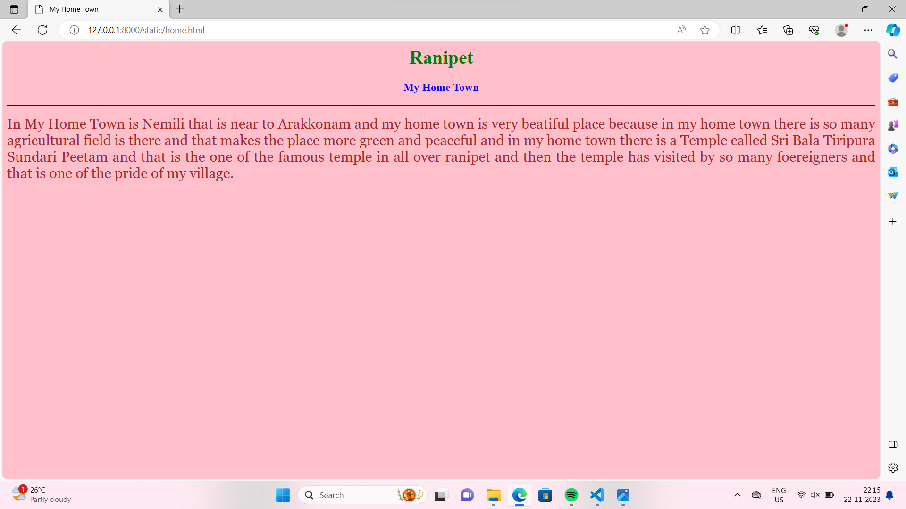

# Ex04 Places Around Me
## Date: 22.11.2023

## AIM
To develop a website to display details about the places around my house.

## DESIGN STEPS

### STEP 1
Create a Django admin interface.

### STEP 2
Download your city map from Google.

### STEP 3
Using ```<map>``` tag name the map.

### STEP 4
Create clickable regions in the image using ```<area>``` tag.

### STEP 5
Write HTML programs for all the regions identified.

### STEP 6
Execute the programs and publish them.

## CODE
```
map.html

<html>
<head>
<title>My City</title>
</head>
<body>
<h1 align="center">
<font color="red"><b>Ranipet</b></font>
</h1>
<h3 align="center">
<font color="blue"><b>Praveena M (23013626)</b></font>
</h3>
<center>

<map name="MyCity">
<area shape="rect" coords="700,450,900,500" href="tirumalpur.html" title="Manikandeeswara Temple">
<area shape="rect" coords="500,400,600,300" href="home.html" title="My Home Town">
<area shape="rect" coords="800,150,25,25" href="arakkonam.html" title="Railway station">
<area shape="rect" coords="50,100,500,360" href="mahendravadi.html" title="Rock Cut Temple">
<area shape="rect" coords="70,200,800,700" href="panapakkam.html" title="Panapakkam-Handloom Companies">
</map>
</center
</body>
</html>

Arakkonam.html

<html>
<head>
<title>My Home Town</title>
</head>
<body bgcolor="lime">
<h1 align="center">
<font color="red"><b>Ranipet</b></font>
</h1>
<h3 align="center">
<font color="blue"><b>Arakkonam-Railway station</b></font>
</h3>
<hr size="3" color="red">
<p align="justify">
<font face="Georgia" size="5">
There is a Railway Station in Arakkonam which is the one of the oldest railway station in india,located on the Guntakal-Chennai Egmore Section of Mumbai-Chennai line of the southern Railway Zone. Maximum number of express
and super fast express bound for Bangalore,Coimbatore,Tirupati,Thiruvananthapuram and Mumbai will have stoppage at Arakkonam. It helps so many woring people nearer to arakkonam.</font>
</p>
</body>
</html>

home.html

<html>
<head>
<title>My Home Town</title>
</head>
<body bgcolor="pink">
<h1 align="center">
<font color="green"><b>Ranipet</b></font>
</h1>
<h3 align="center">
<font color="blue"><b>My Home Town</b></font>
</h3>
<hr size="3" color="blue">
<p align="justify">
<font face="Georgia" size="5" color="brown">
In My Home Town is Nemili that is near to Arakkonam and my home town is very beatiful place because in my home town there is so many agricultural field is there and that makes the place more green and peaceful and in my home town there is a Temple called Sri Bala Tiripura Sundari Peetam and that is the one of the famous temple in all over ranipet and then the temple has visited by  so many foereigners and that is one of the pride of my village.
</p>
</body>
</html>

mahendravadi.html

<html>
<head>
<title>My Home Town</title>
</head>
<body bgcolor="yellow">
<h1 align="center">
<font color="red"><b>Ranipet</b></font>
</h1>
<h3 align="center">
<font color="black"><b> Mahendravadi-Rock Cut Temple</b></font>
</h3>
<hr size="3" color="violet">
<p align="justify">
<font face="Georgia" size="5" color="brown">
Mahendravadi is a historical ancient 6th century Pallava Dynasty town during Mahendra Varman 1, in Nemili Taluk,Tamil Nadu, in Northern Tamil Nadu of India. Mahendravarman 1 established Mahendravadi town as one of the second largest town during rule and it is a starting point of the pallava's Rock Cut sculptures history that we see in Kanchipuram and Mamallapuram.</font>
</p>
</body>
</html>

panapakkam.html

<html>
<head>
<title>My Home Town</title>
</head>
<body bgcolor="cyan">
<h1 align="center">
<font color="purple"><b>Ranipet</b></font>
</h1>
<h3 align="center">
<font color="blue"><b>Panapakkam-Handloom Companies</b></font>
</h3>
<hr size="3" color="red">
<p align="justify">
<font face="Georgia" size="5" color="white">
Discover a wide range of cotton lungi from top manufactures,dealers, adn distribution across panapakkam. Explore available options in nearby cities like Nagari, Tiruvallur, Gudiyattam, and more prices in panapakkam range from 119 to 350 INR forvarious types,including cotton Lungi for regular use, Easy washable cotton Lungi in checkes pattern, casual wear occasion and more. Take advantage of exclusive deals on Tradeindia when ordering in bulk.</font> 
</p>
</body>
</html>

tirumalpur.html

<html>
<head>
<title>My Home Town</title>
</head>
<body bgcolor="orange">
<h1 align="center">
<font color="green"><b>Ranipet</b></font>
</h1>
<h3 align="center">
<font color="blue"><b>Tirumalpur-Manikandeeswara Temple</b></font>
</h3>
<hr size="3" color="yellow">
<p align="justify">
<font face="Georgia" size="5" color="brown">
Tirumalpur is the small village that is nearer to my village and tirumalpur contains so many temples with wonderful scenerio and the temples have wonderful sculptures and peaceful environment. Tirumalpur is an important temple town and a suburb of kanchipuram,Tamil Nadu. It is also an suburban train station along the south west line of chennai suburban Railway. The plae is famous for the historic Thirumarperu Shiva temple and Manikandeeswara Temple.</font>
</p>
</body>
</html>
```

## OUTPUT





## RESULT
The program for implementing image maps using HTML is executed successfully.
